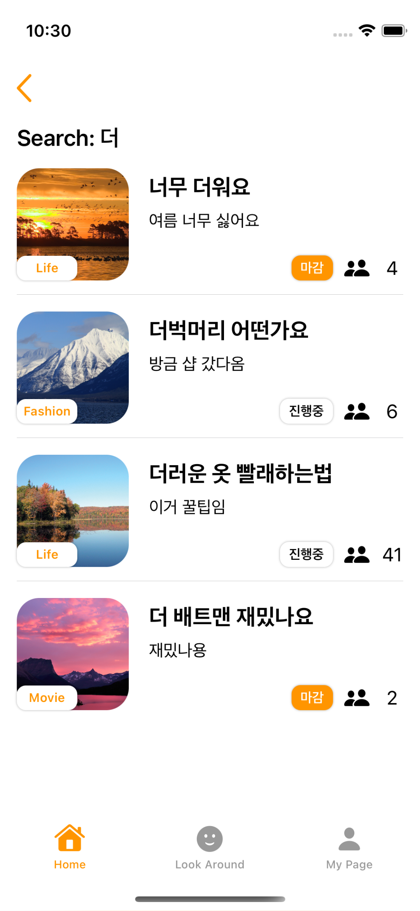

# :iphone: A&A

"What should I have for lunch today?" Ask questions whenever you're hesitated with concerns in daily life.

## :pushpin: Features

- See popular/recent topics
- Search topics
- Upload topic
- Real-time voting
- Edit profile
- View the list of topics users have posted and responded to

## :people_hugging: Authors

- [@Jun](https://github.com/2youngjun) | [@Badger](https://github.com/Byeonjinha) | [@Ben](https://github.com/dkdo1406) | [@D-Park](https://github.com/Junghoon-P) | [@Digi](https://github.com/pagh2322) | [@Zero](https://github.com/yys88699)

## :framed_picture: Demo

[Youtube](https://www.youtube.com/watch?v=BT16zmiQzME)

## :fireworks: Screenshots

## :sparkles: Skills & Tech Stack
SwiftUI

## :books: Documentation

## :lock_with_ink_pen: License

[MIT](https://choosealicense.com/licenses/mit/)
